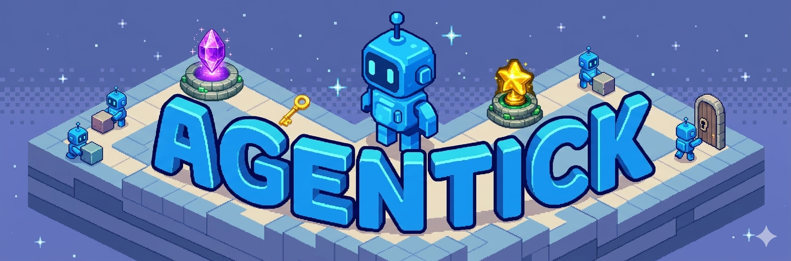

<p align="center">
  
</p>

<p align="center">
  <strong>Universal benchmark for evaluating AI agents</strong>
</p>

<p align="center">
  <a href="https://arxiv.org/abs/2605.06869"></a>
  <a href="https://roger-creus.github.io/agentick/blog/introducing-agentick/"></a>
  <a href="https://roger-creus.github.io/agentick/"></a>
  <a href="https://roger-creus.github.io/agentick/board/"></a>
  <a href="https://www.python.org/"></a>
  <a href="LICENSE"></a>
</p>

Universal benchmark for evaluating AI agents. Train and evaluate any agent type — RL, LLM, VLM, hybrid, or human — across procedurally generated gridworld tasks.

<p align="center">
  <b><a href="https://roger-creus.github.io/agentick/board/">Check out the live leaderboard</a></b> · <a href="https://arxiv.org/abs/2605.06869">Paper (arXiv)</a> · <a href="https://roger-creus.github.io/agentick/leaderboard/">How to submit your agent</a>
</p>

<p align="center">
  
  
  
</p>

## Key Features

- **37 Tasks** across navigation, planning, reasoning, memory, generalization, and multi-agent coordination
- **Multi-Modal Observations**: isometric pixel sprites, ASCII text, natural language, structured state
- **Training-First**: trajectory export, SFT fine-tuning, RL baselines
- **Universal Support**: RL, LLMs, VLMs, bots, humans
- **Capability Decomposition**: radar charts showing agent strengths/weaknesses
- **Experiment System**: pre-configured YAML configs, reproducible evaluation, leaderboard

## Try It First

The fastest way to explore Agentick is the **interactive webapp** — play tasks yourself and browse all observation modalities:

```bash
git clone --filter=blob:none --depth 1 https://github.com/roger-creus/agentick.git && cd agentick
uv sync --extra webapp
uv run python -m agentick.human.webapp   # Opens http://127.0.0.1:8080
```

## Quick Start

```python
import agentick

env = agentick.make("GoToGoal-v0")
obs, info = env.reset()

for _ in range(100):
    action = env.action_space.sample()
    obs, reward, terminated, truncated, info = env.step(action)
    if terminated or truncated:
        break

env.close()
```

## Installation

```bash
curl -LsSf https://astral.sh/uv/install.sh | sh   # Install uv
git clone --filter=blob:none --depth 1 https://github.com/roger-creus/agentick.git
cd agentick
uv sync
uv run agentick --version
```

If you want the full git history later (for `git bisect` or changelog review), switch after the shallow checkout:

```bash
git fetch --unshallow
```

### Dependency Groups

```bash
uv sync                     # Core only (gymnasium, numpy, pygame, Pillow)
uv sync --extra rl          # RL training (torch, stable-baselines3)
uv sync --extra llm         # LLM agents (openai, anthropic, google-genai, transformers)
uv sync --extra vllm        # vLLM serving
uv sync --extra finetune    # Fine-tuning (trl, peft, datasets)
uv sync --extra tracking    # Experiment tracking (wandb)
uv sync --extra viz         # Visualization (matplotlib, seaborn, plotly)
uv sync --extra webapp      # Human play webapp (flask)
uv sync --extra all         # Everything
```

## Render Modes

| Mode | Description | Output |
|------|-------------|--------|
| `"ascii"` | ANSI-colored text grid (default) | `str` |
| `"language"` | Natural language description | `str` |
| `"language_structured"` | Structured dict with position, surroundings | `dict` |
| `"rgb_array"` | **Isometric pixel sprites** (512x512, Kenney assets) | `np.ndarray` |
| `"state_dict"` | Numpy arrays for grid layers and agent state | `dict` |

```python
env = agentick.make("MazeNavigation-v0", render_mode="rgb_array")  # Isometric pixels
env = agentick.make("MazeNavigation-v0", render_mode="language")   # Natural language
```

## Task Gallery

| Capability | Example Tasks | Count |
|------------|---------------|-------|
| Navigation | GoToGoal, MazeNavigation, CuriosityMaze, TimingChallenge | 8 |
| Planning | SokobanPush, KeyDoorPuzzle, PackingPuzzle, ToolUse | 9 |
| Reasoning | SwitchCircuit, GraphColoring, SymbolMatching, ProgramSynthesis | 8 |
| Memory | SequenceMemory, DelayedGratification, TreasureHunt, FogOfWar | 4 |
| Generalization | FewShotAdaptation, DistributionShift, NoisyObservation | 3 |
| Multi-Agent | CooperativeTransport, ChaseEvade, Herding, EmergentStrategy | 5 |

**Total: 37 tasks**, each with 4 difficulty levels (easy, medium, hard, expert).

## Examples

```bash
# Basic usage
uv run python examples/basics/01_make_and_step.py

# RL training with SB3 (requires `uv sync --extra rl`; long-running)
uv run python examples/rl/sb3_ppo.py

# LLM agent (requires `uv sync --extra llm` and an API key)
export OPENAI_API_KEY="your-openai-api-key"
uv run python examples/llm/openai_text_agent.py

# Data collection from oracles (requires `uv sync --extra finetune`)
uv run python examples/data_and_finetuning/collect_oracle_trajectories.py --tasks GoToGoal-v0 --difficulties easy --n-episodes 1 --output-dir trajectories/oracle-smoke

# Run a full benchmark experiment (long-running)
uv run python -m agentick.experiments.run --config examples/experiments/configs/random_agent.yaml
```

## Experiment Runner

The primary interface for benchmarking is the experiment runner with YAML configs:

```yaml
name: my-agent
agent:
  type: llm
  hyperparameters:
    backend: openai
    model: gpt-4o
    harness: markovian_zero_shot
    observation_modes: [language]
tasks: "full"
difficulties: [easy, medium, hard, expert]
n_seeds: 25
n_episodes: 1
output_dir: results/my-agent
```

```bash
uv run python -m agentick.experiments.run --config config.yaml
```

## Oracle Trajectory Datasets

Pre-built datasets of expert trajectories for SFT fine-tuning:

| Dataset | Rows |
|---------|------|
| [`agentick-oracle-trajectories-120k`](https://huggingface.co/datasets/rogercc/agentick-oracle-trajectories-120k) | 120K per-step rows |
| [`agentick-oracle-trajectories-250k`](https://huggingface.co/datasets/rogercc/agentick-oracle-trajectories-250k) | 250K per-step rows |
| [`agentick-oracle-trajectories-500k`](https://huggingface.co/datasets/rogercc/agentick-oracle-trajectories-500k) | 500K per-step rows |

Each row: `task`, `difficulty`, `ascii_render`, `language_render`, `action_int`, `reward`, `done`. Train/test use different deterministic seeds. See [Fine-Tuning docs](docs/agents/finetuning.md) for SFT training with TRL.

## Leaderboard

Submit your results for inclusion on the [public leaderboard](https://roger-creus.github.io/agentick/board/):

1. Run evaluation on all 37 tasks with official eval seeds
2. Validate: `uv run python scripts/validate_submission.py results/<run>/`
3. Email the generated zip to `roger.creus-castanyer@mila.quebec`

See [docs/leaderboard.md](docs/leaderboard.md) for details and check out the [public leaderboard](https://roger-creus.github.io/agentick/board/).

## CLI

```bash
uv run agentick --version        # Show version
uv run agentick list-tasks       # List all 37 tasks
uv run agentick list-suites      # List benchmark suites
uv run agentick info GoToGoal-v0 # Task details
```

## Documentation

- [Quickstart](docs/getting_started/quickstart.md)
- [Tasks](docs/tasks.md)
- [Observations](docs/concepts/observations.md)
- [RL Agents](docs/agents/rl_agents.md)
- [LLM/VLM Agents](docs/agents/llm_agents.md)
- [Experiments](docs/experiments.md)
- [Leaderboard](docs/leaderboard.md)

## Project Structure

```
agentick/
├── agentick/               # Core library
│   ├── core/              # Environment, grid, renderer, types
│   ├── tasks/             # 37 task implementations
│   ├── oracles/           # Optimal reference policies
│   ├── agents/            # LLM/VLM agent harnesses
│   ├── leaderboard/       # Evaluation system and suites
│   ├── data/              # Trajectory collection
│   ├── training/          # SFT trainer (TRL)
│   └── human/             # Web showcase and human play
├── examples/              # Runnable examples
├── docs/                  # Documentation + showcase gallery
└── tests/                 # Test suite
```

## Roadmap

Features on the `dev` branch for future releases:

- Non-markovian conversation history harnesses
- Tinker RL training integration
- Behaviour cloning from pixels
- Curriculum learning
- Vector environments for parallel training
- Docker/git-repo [leaderboard](https://roger-creus.github.io/agentick/board/) submission types
- SFT model evaluation pipeline

## Citation

```bibtex
@article{agentick2026,
  title={Agentick: Universal Benchmark for AI Agents},
  author={Creus Castanyer, Roger},
  journal={arXiv preprint arXiv:2605.06869},
  year={2026},
  url={https://arxiv.org/abs/2605.06869}
}
```

## License

MIT License - see [LICENSE](LICENSE) file for details.

## Acknowledgments

Built with [Gymnasium](https://gymnasium.farama.org/), inspired by research in agent evaluation and general intelligence.
